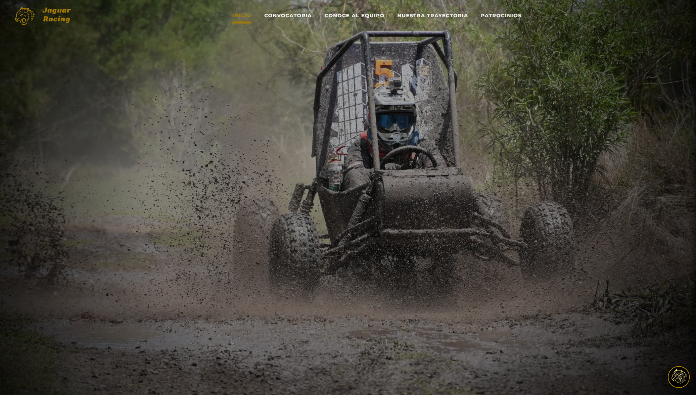
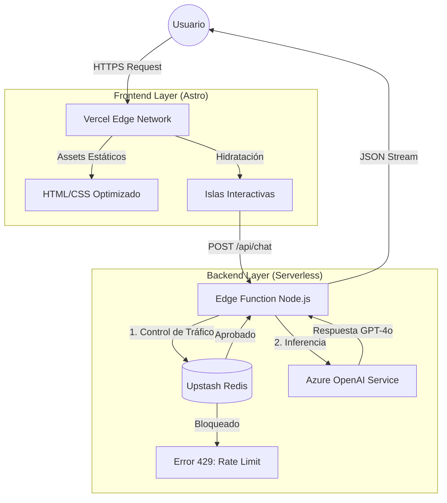

<div align="center">
  
  <br/>
  <h1>Jaguar Racing Web Platform</h1>
  <p>
    <b>Escudería Oficial ESIME Azcapotzalco - IPN</b><br/>
    <i>Ingeniería de alto rendimiento y arquitectura Cloud.</i>
  </p>

  <a href="https://astro.build">
    
  </a>
  <a href="https://azure.microsoft.com">
    
  </a>
  <a href="https://vercel.com">
    
  </a>
  <a href="https://redis.io">
    
  </a>
  <a href="LICENSE">
    
  </a>
</div>

<br/>

<div align="center">
  <a href="https://jaguar-racing.vercel.app">
    
  </a>
  <p>
    <i>Clic en la imagen para visitar la plataforma oficial</i>
  </p>
</div>

## Sobre el Proyecto

Bienvenido al repositorio oficial de la plataforma web de **Jaguar Racing**. Este proyecto fue desarrollado por el área de Redes para transformar la presencia digital de la escudería, pasando de ser un sitio informativo estático a una herramienta de gestión integral.

**Funcionalidades principales:**
1.  **Dossier Técnico Digital:** Visualización y documentación técnica de los prototipos de competencia (Baja SAE), enfocada en demostrar la capacidad de manufactura e ingeniería del equipo.
2.  **Pipeline de Reclutamiento:** Sistema de filtrado para nuevos aspirantes, segregando perfiles por competencias técnicas específicas (SolidWorks, Estática, Mecánica) para áreas críticas como Suspensión, Chasis y Ergonomía.
3.  **IA con 'Gatekeeping':** Asistente virtual con reglas de negocio estrictas (System Prompting). Prioriza la conversión de patrocinadores y reclutas, mientras bloquea activamente consultas irrelevantes o fuera de dominio (ej: tareas escolares, temas ajenos a la escudería).
4.  **Hub de Negocios:** Módulo enfocado a la captación de capital, destacando beneficios clave para socios comerciales (Incentivos fiscales, exposición de marca y acceso a talento politécnico).


## Ingeniería y Arquitectura

Esta sección detalla las decisiones técnicas para desarrolladores y colaboradores. El sistema opera bajo una arquitectura **Serverless** utilizando el patrón de "Islas" (Islands Architecture) para maximizar el rendimiento.

### Diagrama de Arquitectura
Flujo de datos e interacción de servicios en la nube:



### Estructura del Repositorio

El árbol de directorios sigue una convención semántica estricta para escalabilidad:

```text
JAGUAR-RACING/
├── public/                 # Assets estáticos de acceso público (Dossiers, SVGs)
├── src/
│   ├── assets/             # Assets procesados en tiempo de compilación (Imágenes optimizadas)
│   ├── components/         # Biblioteca de componentes UI reutilizables
│   ├── data/               # Fuentes de datos estáticas (JSON) para hidratación de contenido
│   ├── layouts/            # Plantillas maestras de estructura HTML
│   ├── lib/                # Lógica de servidor y clientes de bases de datos (Redis)
│   ├── pages/              # Enrutamiento basado en sistema de archivos
│   │   └── api/            # Endpoints Serverless (Backend-for-Frontend)
│   ├── scripts/            # Lógica de cliente vanilla JS (ChatWidget, UI interactiva)
│   └── styles/             # Hojas de estilo modulares y globales
├── astro.config.mjs        # Configuración del compilador y adaptadores
└── vercel.json             # Configuración de despliegue e infraestructura

```

## Configuración del Entorno de Desarrollo

Para replicar el entorno localmente, se requiere Node.js v22+ y acceso a las credenciales de los servicios en la nube.

### 1. Instalación de Dependencias

```bash
git clone https://github.com/JaguarRacingIPN/JaguarRacing.git
cd Jaguar-Racing
npm install

```

### 2. Variables de Entorno

El sistema no funcionará sin las claves de API correctas. Crear un archivo `.env` en la raíz basado en `.env.example`.

**Importante:** Nunca commitear claves de producción.

```ini
# Inteligencia Artificial (Azure OpenAI)
AZURE_OPENAI_API_KEY="SECRET_KEY"
AZURE_OPENAI_ENDPOINT="https://<RESOURCE>.openai.azure.com/"
AZURE_OPENAI_DEPLOYMENT="gpt-4o-mini"
AZURE_OPENAI_VERSION="2024-02-15-preview"

# Base de Datos (Vercel KV / Upstash Redis)
# Nota: Si usas Vercel CLI, estas se descargan automáticamente con 'vercel env pull'
KV_REST_API_URL="https://<DB>.upstash.io"
KV_REST_API_TOKEN="SECRET_TOKEN"
KV_REST_API_READ_ONLY_TOKEN="OPTIONAL_READ_ONLY"

```

### 3. Ejecución

```bash
npm run dev

```

El servidor de desarrollo estará disponible en `http://localhost:4321`.

---

## Flujo de Desarrollo y Contribución

Agradecemos las contribuciones de la comunidad politécnica.

1. **Guía de Contribución:** Por favor lee el archivo [CONTRIBUTING](/CONTRIBUTING.md) para conocer nuestros estándares de código, política de branching y proceso de Pull Requests.
2. **Reporte de Bugs:** Si encuentras un error, abre un *Issue* describiendo el problema y los pasos para reproducirlo.

## Licencia

Este proyecto está bajo la Licencia MIT. Consulta el archivo [LICENSE](/LICENSE) para más detalles.

---

<p align="center">
<b>Jaguar Racing Engineering Team</b><br>
ESIME Azcapotzalco - Instituto Politécnico Nacional<br>
<i>Impulsado por Microsoft Azure for Students & Vercel Education</i>
</p>
