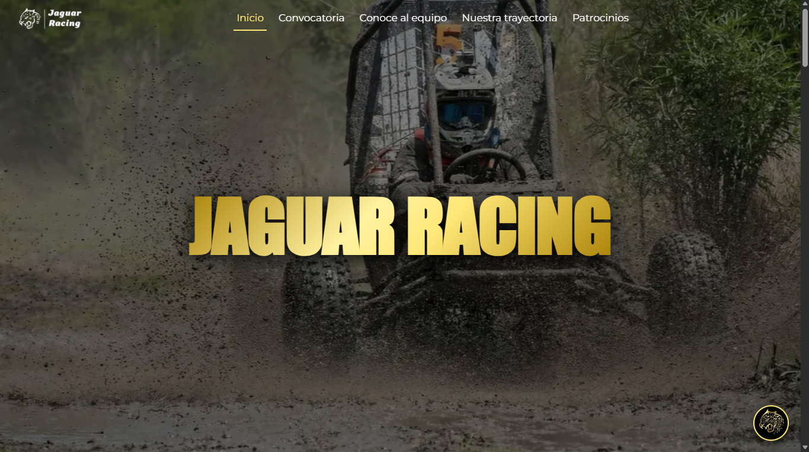

<div align="center">
  
  <br/>
  <h1>Jaguar Racing Web Platform 2.0</h1>
  <p>
    <b>Escudería Oficial ESIME Azcapotzalco - IPN</b><br/>
    <i>Actualización digital para la Escudería ESIME Azcapotzalco</i>
  </p>

  <a href="https://astro.build">
    
  </a>
  <a href="https://nodejs.org">
    
  </a>
  <a href="https://vercel.com">
    
  </a>
  <a href="https://azure.microsoft.com">
    
  </a>
  <a href="https://redis.io">
    
  </a>
  <a href="https://developer.mozilla.org/es/docs/Web/CSS">
    
  </a>
  <a href="https://vercel.com/analytics">
    
  </a>
</div>

<br/>

[](https://jaguar-racing.vercel.app)
> *Clic en la imagen para visitar la plataforma oficial.*

---

## 🚀 Visión General

Sistema web integral diseñado para la transformación digital de los procesos administrativos y de difusión de Jaguar Racing. Centraliza el reclutamiento de nuevos miembros, la captación de patrocinios mediante una interfaz profesional y automatiza la atención de dudas frecuentes.

Esta iteración marca la transición hacia una arquitectura de Islas Interactivas con Astro, abandonando el renderizado tradicional para priorizar la carga de contenido crítico. Actualmente en fase de optimización activa, el proyecto busca reducir el Time-to-Interactive (TTI) y mejorar la fluidez en dispositivos móviles mediante estrategias de carga diferida y reducción de JavaScript en el cliente.

## ✨ Características Clave

| Característica | Descripción Técnica |
| :--- | :--- |
| 🤖 **AI-Powered Chatbot** | Asistente inteligente potenciado por **Azure OpenAI (GPT-4o-mini)**. Utiliza ingeniería de prompts ("System Prompt") para filtrar temas irrelevantes y ofrecer respuestas técnicas precisas. |
| 🛡️ **Smart Security** | Protección contra ataques DDoS y control de costos mediante **Rate Limiting** distribuido con **Upstash Redis** (<10ms latencia), limitando peticiones por IP y usuario. |
| 🏎️ **Core Híbrido** | Construido sobre **Astro**, combinando la velocidad de un sitio estático con la interactividad dinámica solo donde se necesita (Islas). |
| ☁️ **Serverless Architecture** | Infraestructura desplegada en **Vercel** con funciones Node.js (v24) que escalan a cero, logrando una eficiencia de costos total ($0 en inactividad). |
| 📊 **Real-time Analytics** | Tablero de observabilidad integrado con **Vercel Analytics**. Monitoreo de sesiones, geolocalización de visitantes y métricas de rendimiento (Web Vitals) con historial de 30 días. |

## 🛠️ Arquitectura del Sistema

El sistema opera bajo un modelo **Serverless**. El frontend se entrega desde la CDN (Edge), mientras que las interacciones complejas (Chatbot) invocan funciones nube bajo demanda.

1.  **Usuario:** Interactúa con la interfaz Astro.
2.  **Edge Network:** Entrega HTML/CSS/JS estático en milisegundos.
3.  **API Route (`POST /api/chat`):**
    * Valida seguridad con **Redis** (Rate Limit).
    * Consulta a **Azure OpenAI** con el contexto del equipo.
    * Devuelve la respuesta al usuario en tiempo real.

<div align="center">
  
</div>

## 📂 Estructura del Proyecto (Astro)

```bash
JAGUAR-RACING/
├── public/              # Assets estáticos (Imágenes optimizadas, Fuentes)
├── src/
│   ├── components/      # Bloques UI reutilizables
│   │   ├── ChatWidget.astro  # Lógica del Chat (UI + JS Cliente)
│   │   ├── Header.astro      # Navegación con detección de ruta activa
│   │   └── Footer.astro
│   ├── layouts/         # Plantilla base (SEO, Meta tags, Estilos globales)
│   ├── pages/           # Rutas del sitio
│   │   ├── api/         
│   │   │   └── chat.js  # ☁️ Serverless Function (Backend del Chat)
│   │   ├── index.astro  # Página de Inicio
│   │   └── team.astro   # Página de Equipo
│   └── styles/          # CSS Modular (indexCuerpo.css, widget_chat.css)
├── .env                 # Variables de entorno (NO SUBIR A GITHUB)
└── astro.config.mjs     # Configuración del compilador
```

## 💻 Instalación Local
Si eres parte del equipo de desarrollo, sigue estos pasos para levantar el entorno:

1. Clonar el repositorio:
```bash
git clone [https://github.com/jaguar-racing/web-platform.git](https://github.com/jaguar-racing/web-platform.git)
cd Jaguar-Racing
```
2. Instalar dependencias:
```bash
npm install
```
3. Configurar Entorno (.env): Crea un archivo .env en la raíz del proyecto (junto a package.json) y solicita las claves al líder de proyecto:
```bash
Fragmento de código

# Inteligencia Artificial
AZURE_OPENAI_API_KEY="tu_clave_aqui"
AZURE_OPENAI_ENDPOINT="[https://tu-recurso.openai.azure.com/](https://tu-recurso.openai.azure.com/)"
AZURE_OPENAI_DEPLOYMENT="gpt-4o-mini"

# Base de Datos (Rate Limiting)
KV_REST_API_URL="[https://tu-db.upstash.io](https://tu-db.upstash.io)"
KV_REST_API_TOKEN="tu_token_aqui"
```
4. Iniciar Servidor de Desarrollo:
```bash
npm run dev
```
Visita http://localhost:4321 para ver los cambios en tiempo real.

## 🤝 Contribución

1. Usa la rama dev para nuevas características.
2. Mantén los estilos en archivos CSS separados dentro de src/styles/.
3. NUNCA subas el archivo .env al repositorio.

## Créditos

Desarrollado por el área de Redes de **Jaguar Racing (ESIME Azcapotzalco)**.
Proyecto impulsado por tecnologías de **Microsoft Azure for Students** y **Vercel Education**.